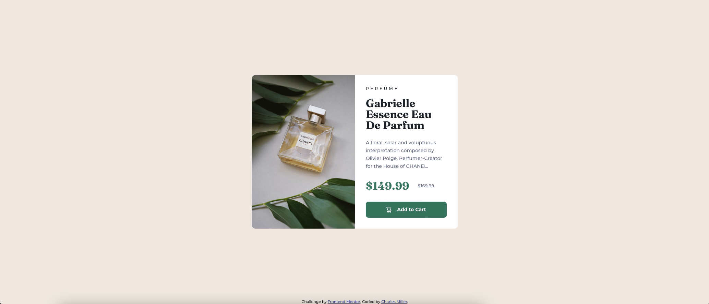

# Frontend Mentor - Product preview card component solution

This is a solution to the [Product preview card component challenge on Frontend Mentor](https://www.frontendmentor.io/challenges/product-preview-card-component-GO7UmttRfa). Frontend Mentor challenges help you improve your coding skills by building realistic projects.

## Table of contents

- [Frontend Mentor - Product preview card component solution](#frontend-mentor---product-preview-card-component-solution)
  - [Table of contents](#table-of-contents)
  - [Overview](#overview)
    - [The challenge](#the-challenge)
    - [Screenshot](#screenshot)
    - [Links](#links)
  - [My process](#my-process)
    - [Built with](#built-with)
    - [What I learned](#what-i-learned)
  - [Author](#author)

## Overview

### The challenge

Users should be able to:

-   View the optimal layout depending on their device's screen size
-   See hover and focus states for interactive elements

### Screenshot



### Links

-   Solution URL: [Add solution URL here](https://github.com/charlesmiller0412/product_preview_component)
-   Live Site URL: [Add live site URL here](https://charlesmiller0412.github.io/product_preview_component/)

## My process

### Built with

-   [React](https://reactjs.org/) - JS library
-   [Bootstrap](https://getbootstrap.org/) - React framework
-   CSS custom properties

### What I learned

I wanted to use this opportunity to refresh myself on React. This will be my main focus for development as I focus on the MERN stack as well as Next.JS. I also took the time to look in to CSS variables as I usually used SCSS.

```css
:root {
    --dark-cyan: hsl(158, 36%, 37%);
    --cream: hsl(30, 38%, 92%);
    --very-dark-blue: hsl(212, 21%, 14%);
    --dark-gray-blue: hsl(228, 12%, 48%);
    --white: hsl(0, 0%, 100%);
}
```

```js
<div id="col-left" class="col-sm-6 d-block">
    
    
</div>
```

## Author

-   Website - [Charles Miller](https://www.charlesmiller.dev)
-   Frontend Mentor - [@charlesmiller0412](https://www.frontendmentor.io/profile/charlesmiller0412)
